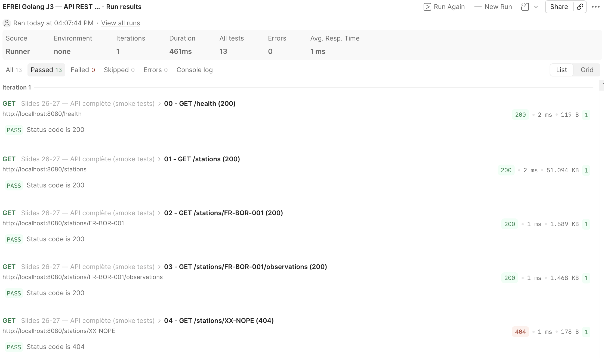
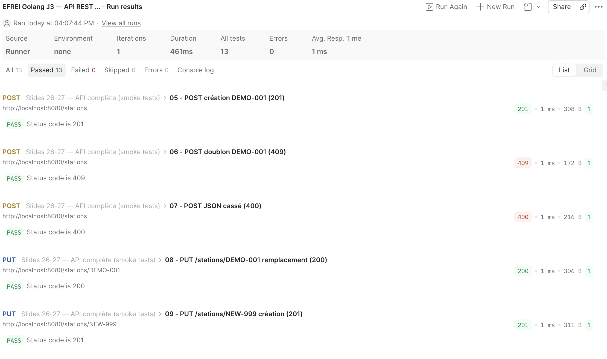
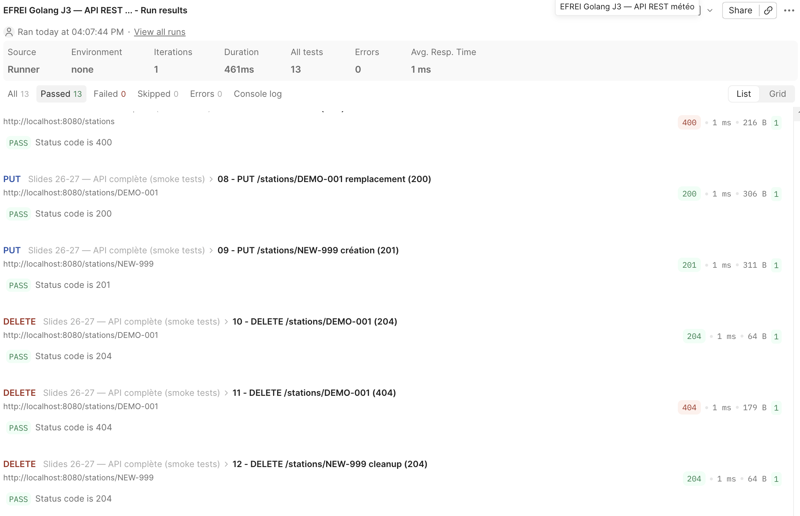

 ## Lancer le serveur
 Il faut être placé dans le dossier "/weather" à la racine du projet puis exécuter la commmande suivante :
 ```bash
go run ./tp3/server
 ```

## Les 7 routes et leurs codes statut attendus

| Route                           | Codes statuts attendus |
|:--------------------------------|:-----------------------|
| GET /health                     | 200                    |
| GET /stations                   | 200                    |
| GET /stations/{id}              | 200, 404               |
| GET /stations/{id}/observations | 200, 404               |
| POST /stations                  | 201, 400, 409          |
| PUT /stations/{id}              | 200, 201, 400          |
| DELETE /stations/{id}           | 204, 404               |

## Mention de la collection Postman utilisée
La collection Postman utilisée pour tester les différentes routes se situe dans le fichier "EFREI Golang J3 — API REST météo.postman_collection.json" à la racine du dossier "/tp3".

## Captures d'écran du Runner Postman montrant 13/13 OK


